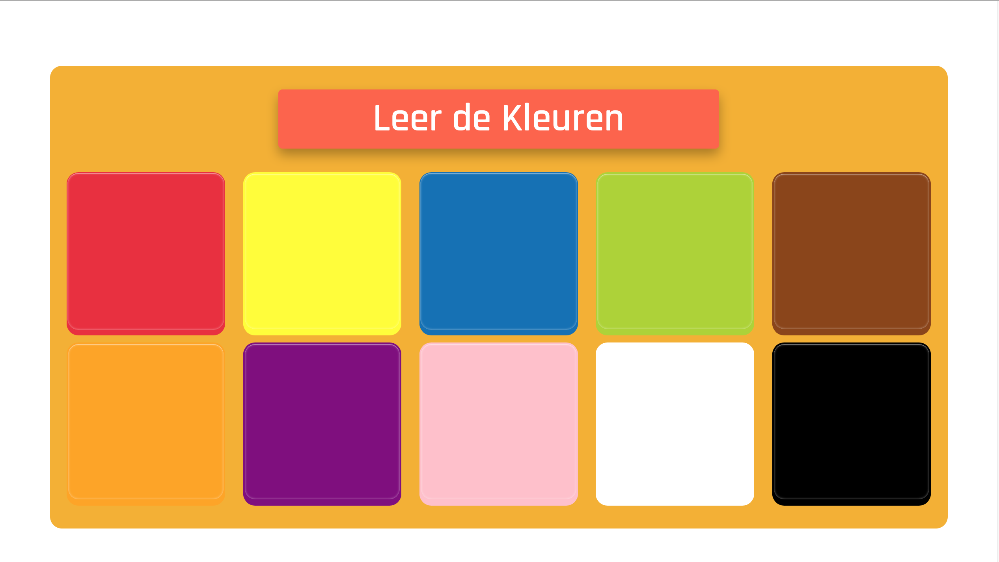
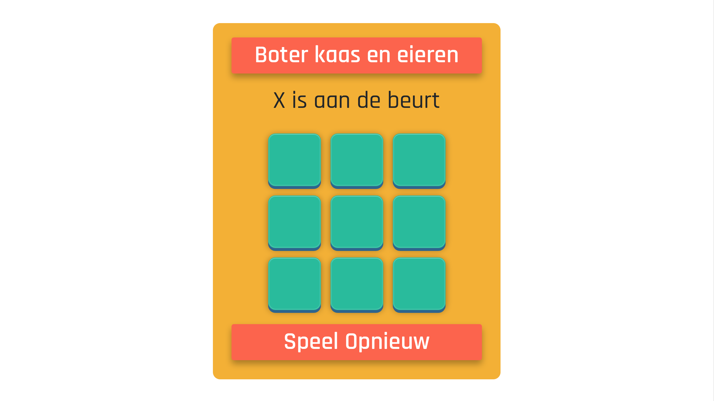
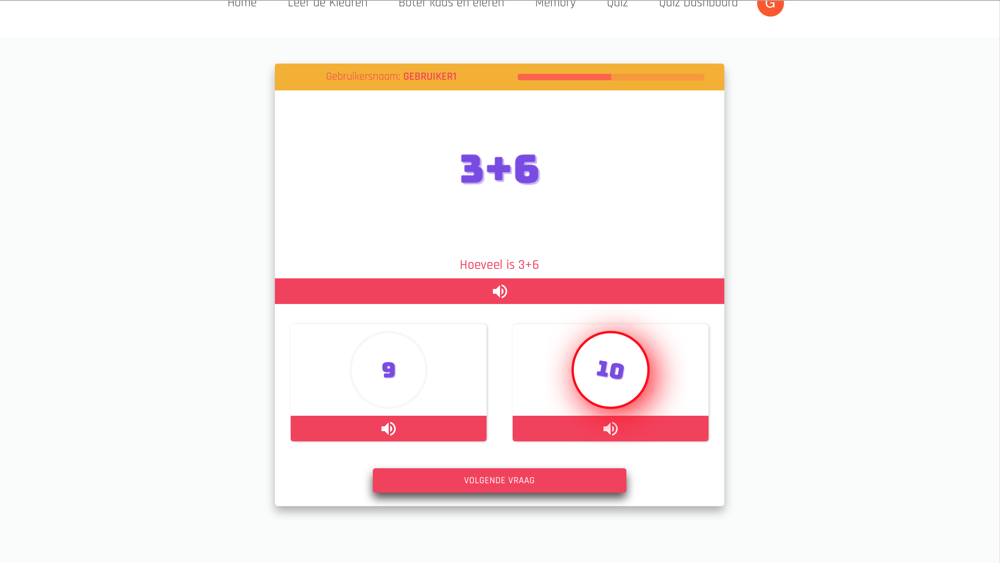

# Kids Online

Kids Online is an application where children can play an easy game and participate in a Quiz set up by the admin panel.

## Link to the app [Kids Online](https://kids-online.netlify.app/).

## Link to the backend repo [Kids Online Backend](https://github.com/chasin87/Kids_Online_be).

## Table of contents:

- **[App demo](#app-demo)**
- **[Goals for this project](#goals-for-this-project)**
- **[Technologies used](#technologies-used)**
- **[User stories](#user-stories)**
- **[Instalation](#instalation)**
- **[Server repo](#server-repo)**

### App Demo:

#### Link to the [YouTube promotion Kids Online] (https://youtu.be/TVZDm3VbKPM)

### Goals for this project

The goal of this project is to build a full-stack app by using technologies I've learned during full-stack web developer bootcamp and using new technologies.

### Technologies used:

#### FRONT END:

#### BACK END:

### User Stories

- As a user, I want to play the simple games
- As a user, I want to play quizes
- As a user, I want to register and choose my level to play the quiz
- As a Admin user, I want to create new questions
- As a Admin user, I want to see all questions
- As a Admin user, I want to delete questions
- As a Admin user, I want to add answers to questions

### Instalation

1. Clone the app
2. cd into your project
3. install dependencies (npm install)
4. Start development server with (npm start)

### Server Repo

The server of this project is built with Express on Node.js connected to Postgres database.

[Click here to view server repo](https://github.com/chasin87/Kids_Online_be)
